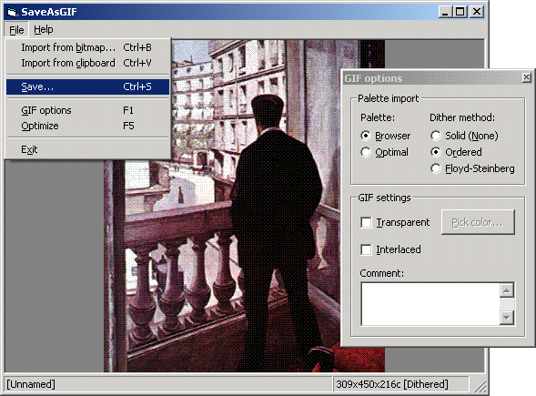



## Image 8\-bpp ditherer \+ native GIF encoder

### Description

First: All thanks to Ron van Tilburg for the amazing VB GIF encoder (original post: CodeId=14210. For GIF decoding, check Vlad Vissoultchev's work: CodeId=44216). This simple application lets you import (dither) to 8-bpp bitmaps and save as GIF format. Transparency and trailing comment now supported. About palette imports: only Halftone-216 and optimal palette are allowed, anyway, you could easily add custom palette import.
 
### More Info
 

             |
---                |---
**Submitted On**   |2003-06-10 15:01:14
**By**             |[Carles P\.V\.](https://github.com/Planet-Source-Code/PSCIndex/blob/master/ByAuthor/carles-p-v.md)
**Level**          |Intermediate
**User Rating**    |5.0 (65 globes from 13 users)
**Compatibility**  |VB 6\.0
**Category**       |[Graphics](https://github.com/Planet-Source-Code/PSCIndex/blob/master/ByCategory/graphics__1-46.md)
**World**          |[Visual Basic](https://github.com/Planet-Source-Code/PSCIndex/blob/master/ByWorld/visual-basic.md)
**Archive File**   |[Image\_8\-bp1763056282004\.zip](https://github.com/Planet-Source-Code/carles-p-v-image-8-bpp-ditherer-native-gif-encoder__1-45899/archive/master.zip)

